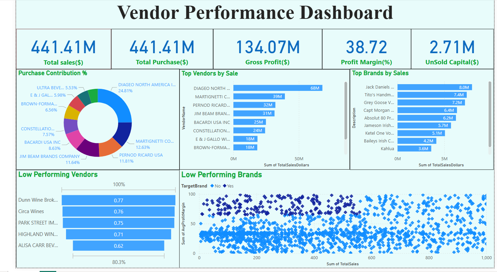

# 📊 Vendor Performance Dashboard

This project presents a **Vendor Performance Analysis Dashboard** built using data from purchases, sales, and vendor details. The goal is to evaluate vendor efficiency, identify top and low-performing vendors/brands, and support strategic procurement decisions.

---

## 🧩 Project Structure

### 🔧 Backend Processing
- **`ingestion_db.py`**  
  Automates ingestion of multiple CSV files into a SQLite database using SQLAlchemy.

- **`get_vendor_suumary.py`**  
  - Extracts data using SQL queries with common table expressions (CTEs).
  - Merges `purchases`, `sales`, and `vendor_invoice` tables.
  - Cleans data, calculates KPIs (Gross Profit, Profit Margin, Stock Turnover, etc.).
  - Outputs a summarized table to the database.

### 📊 Dashboard (Front-End)
- Developed using **Power BI**
- Visualizes:
  - **Total Sales & Purchases**
  - **Gross Profit & Profit Margin**
  - **Top Vendors & Brands**
  - **Low Performing Vendors & Brands**
  - **Purchase Contribution %**
  - **Unsold Capital**

---

## 📷 Dashboard Preview

---

## 📌 Key Metrics

| Metric               | Description                                       |
|----------------------|---------------------------------------------------|
| **Total Sales**      | Total sales value across all vendors              |
| **Total Purchases**  | Total purchase value from vendors                 |
| **Gross Profit**     | Revenue minus purchase costs                      |
| **Profit Margin (%)**| Gross profit as a percentage of total sales       |
| **Unsold Capital**   | Capital tied up in unsold inventory               |
| **Stock Turnover**   | Sales quantity relative to purchase quantity      |
| **Sales to Purchase Ratio** | Indicates vendor profitability and efficiency  |

---

## 🛠 Tools & Technologies Used
- **Python** (Pandas, SQLite, SQLAlchemy)
- **Power BI**
- **SQL (CTEs, joins, aggregations)**
- **Logging & modular script automation**

---

## 📁 Files Included

| File Name                  | Purpose                                |
|----------------------------|----------------------------------------|
| `DashBoard.png`            | Screenshot of Power BI dashboard       |
| `Vendor Performance Analysis.ipynb` | EDA and pre-dashboard analysis |
| `Exploratory Data Analysis.ipynb`   | Data exploration & initial insights |
| `ingestion_db.py`          | Data ingestion to SQLite DB            |
| `get_vendor_suumary.py`    | Vendor summary transformation logic    |

---

## 🚀 How to Run
1. Place CSV data files into a `data/` folder.
2. Run `ingestion_db.py` to ingest into SQLite DB.
3. Run `get_vendor_suumary.py` to generate the summary table.
4. Import the data into Power BI and build or view the dashboard.

data Set download from here:https://drive.google.com/drive/folders/1ROg-HoFMQjGrEvKJcpx9rMNZpAtIKVCP?usp=sharing
